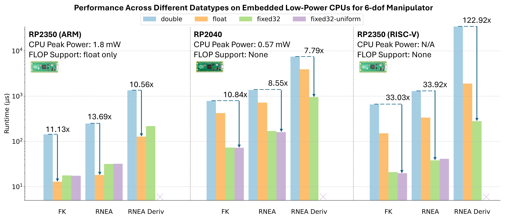
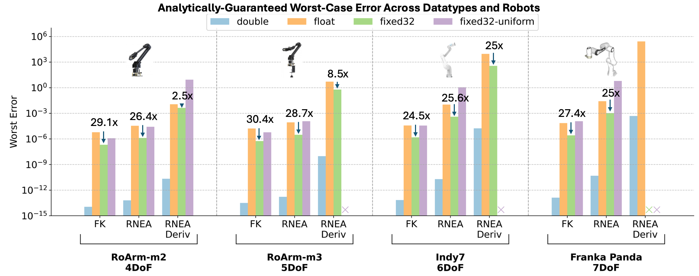

# Benchmarks and Results

This page summarizes the evaluation from the RoboPrec paper for **robotics workloads**, and illustrates how the same pipeline can inform precision choices for **other numeric code**.

For full details, see the paper and the figures referenced below.

---

## Workloads, robots, and platforms

- **Algorithms**: forward kinematics (FK), RNEA, RNEA derivatives.
- **Robots**: RoArm‑M2, RoArm‑M3, Indy7, Franka Emika Panda.
- **Hardware**:
    - Embedded: RP2040, RP2350‑RISC‑V, RP2350‑ARM.
    - Desktop/server‑class: Raspberry Pi 5, Intel i7‑14700K.

All code is compiled with `g++ -O3`.

---

## Performance across CPUs

RoboPrec measures how `double`, `float`, and various fixed‑point formats perform on each platform. The main performance plots in the paper are:

*Figure: Runtimes across embedded CPUs (RP2040, RP2350‑RISC‑V, RP2350‑ARM).*  

*Figure: Runtimes on non‑embedded CPUs (Raspberry Pi 5, Intel i7‑14700K).*  

Key observations:

**Embedded (no / limited FPUs)**

- On RP2040 and RP2350‑RISC‑V (no FPU):
    - `double` is software‑emulated and very slow.
    - RoboPrec‑generated fixed‑point code (e.g., 32‑bit fixed) can be **an order of magnitude faster than `float`**, and up to **~$122\times$ faster than `double`** on some kernels.
- On RP2350‑ARM (single‑precision FPU):
    - `float` is usually the fastest choice.
    - Fixed‑point is still faster than `double`, and can be attractive when you need better accuracy than `float` (see below).

**Desktop / server CPUs**

- On Raspberry Pi 5, `double` tends to be the best trade‑off.
- On Intel i7‑14700K:
 - Uniform fixed‑point (e.g., fixed32) can **match or exceed `double` performance** (≈1.0–1.4× speedups on some kernels).

Even though RoboPrec is motivated by embedded robotics, these results suggest that **precision tuning can also matter on full CPUs**, especially for hotspots inside larger controllers or simulators.

---

## Worst‑case error guarantees

RoboPrec uses static analysis to compute **worst‑case numeric error** for each datatype and workload. The paper’s worst‑case error figure is:

*Figure: Worst‑case error bounds across datatypes, robots, and algorithms.*

Highlights:

- As expected, `double` gives the tightest bounds.
- A key result for robotics and more general numerics:

> For many dynamics‑style kernels, **32‑bit fixed‑point (`fixed32`) has better worst‑case error bounds than `float`**, even though both use 32 bits.

- Across our case studies, fixed32 shows **$2.5\times$–$30.4\times$ smaller worst‑case error** than `float`, depending on the workload.
- For very complex workloads (e.g., RNEA derivatives on 7‑DOF arms), some fixed‑point formats hit potential overflow in the analysis. RoboPrec then **refuses to certify** those precisions, which is exactly the kind of failure mode we want to expose before deployment.

These guarantees apply to robotics, but the same reasoning extends to any numeric kernel where you can specify input ranges.

---

<!--
## Empirical vs analytical error

In addition to worst‑case guarantees, the paper compares analytical bounds to empirical errors over random samples. Example CDFs of empirical error distributions include:

*Figure: Empirical error CDFs for FK on a 6‑DOF arm.*

*Figure: Empirical error CDFs for RNEA.*

*Figure: Empirical error CDFs for RNEA derivatives.*

For simpler kernels like FK, analytical worst‑case bounds track the relative ordering between datatypes (e.g., fixed32 ≪ float) reasonably well, though they are conservative in magnitude. For more complex kernels, bounds become more conservative and highlight where better analysis techniques would be useful.

## Real‑robot demonstration

RoboPrec is evaluated not just on microbenchmarks, but also on a real manipulator:

*Figure: RoArm‑M3 pick‑and‑place driven by RoboPrec‑generated fixed‑point FK on RP2040.*

- Robot: RoArm‑M3.
- Task: pick‑and‑place via inverse kinematics.
- Compute platform: Raspberry Pi Pico RP2040.
- Only forward kinematics inside the IK loop is swapped for RoboPrec‑generated fixed32 code.

Outcome:

- FK subroutine: ≈46% faster in fixed32 than in double.
- End‑to‑end IK: ≈5% reduction in runtime (≈42 ms → ≈40 ms), even with float↔fixed conversions.
- The robot completes the task successfully with the verified kernel.

---
-->

For more detailed methodology and additional plots, please refer to the RoboPrec paper.
